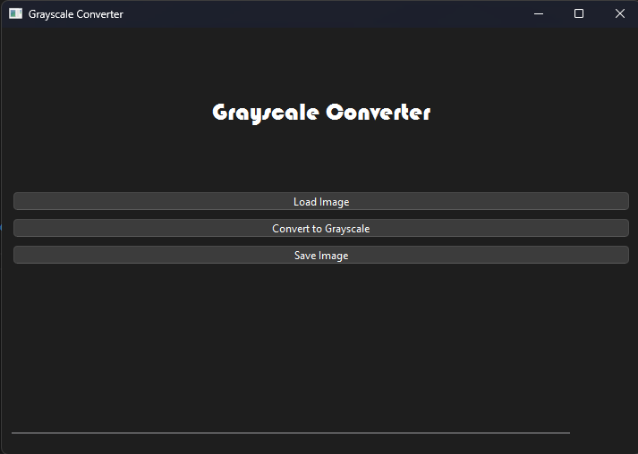

# Grayscale-Converter
This program is a GUI-based application built using PyQt6 for image processing. The main functionalities of the application include loading an image from a file, converting the image to grayscale, and saving the processed image.

The application interface consists of:
- Title Label: Displays the application name "Grayscale Converter".
- "Load Image" Button: Allows users to select and display an image from their computer.
- "Convert to Grayscale" Button: Converts the selected image to grayscale.
- "Save Image" Button: Saves the grayscale image to a chosen file.
- Progress Bar: Indicates the completion of the grayscale conversion process.
- Image Display Area (QLabel): Displays both the original and grayscale images.

## Tools Used
To build this program, the following tools are required:

1. Software Requirements
- Python (version 3.x)
- PyQt6 (for building the GUI)
- Pillow (PIL) (for image processing)

2. Python Libraries Used
- PyQt6.QtWidgets → For creating GUI elements such as buttons, labels, and a progress bar.
- QFileDialog → For opening and saving image files.
- QMessageBox → For displaying warning or notification messages.
- PIL.Image → For processing and converting images to grayscale.
- sys, io → For handling system operations and image data manipulation.

3. Hardware Requirements
A computer or laptop running Windows, Linux, or macOS.

## Steps to Build the Program
1.  Setting Up the UI with PyQt6
- Use Qt Designer or Python code to design the user interface.
- Create a QVBoxLayout layout to arrange UI elements vertically.
- Add UI elements such as QLabel, QPushButton, and QProgressBar.

2. Implementing the Image Loading Feature
- Use QFileDialog to open an image file.
- Use QPixmap to display the selected image in QLabel.

3. Implementing the Grayscale Conversion Feature
- Use Pillow (PIL) to convert the image to grayscale.
- Display the processed grayscale image in QLabel.
- Set QProgressBar to 100% after the conversion is complete.

4. Implementing the Image Saving Feature
- Use QFileDialog to allow users to choose a save location.
- Ensure that the image is saved in a supported format (.png, .jpg, etc.).

## Screenshot

## Instruction
1. Open the application → The GUI will display buttons and an image area.
2. Click "Load Image" → Select an image from your computer (supported formats: .png, .jpg, .jpeg, .bmp).
3. The selected image will be displayed in the application.
4. Click "Convert to Grayscale" → The image will be converted to grayscale.
5. The progress bar will fill up to 100%, indicating the conversion is complete.
6. Click "Save Image" → Choose a location to save the grayscale image.
7. The grayscale image is successfully saved and ready for use.